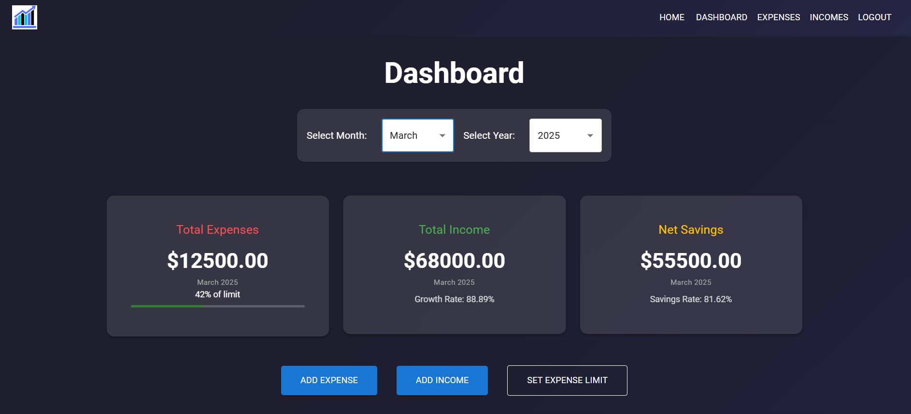
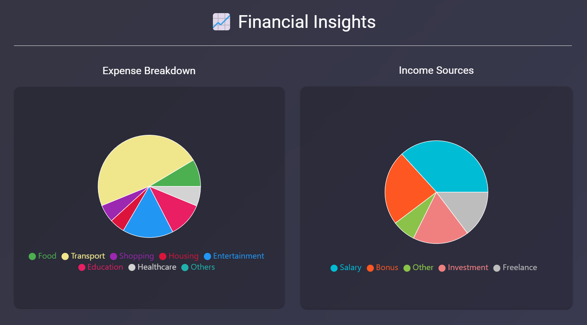
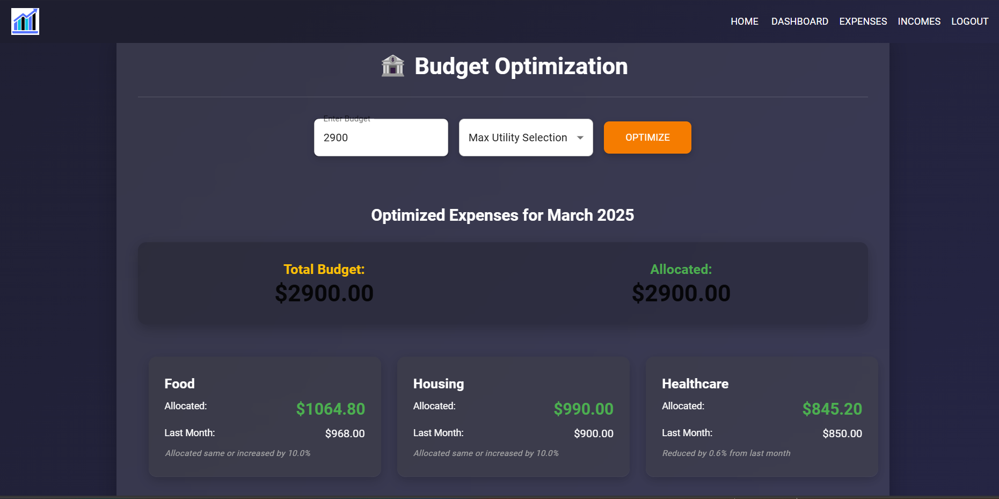
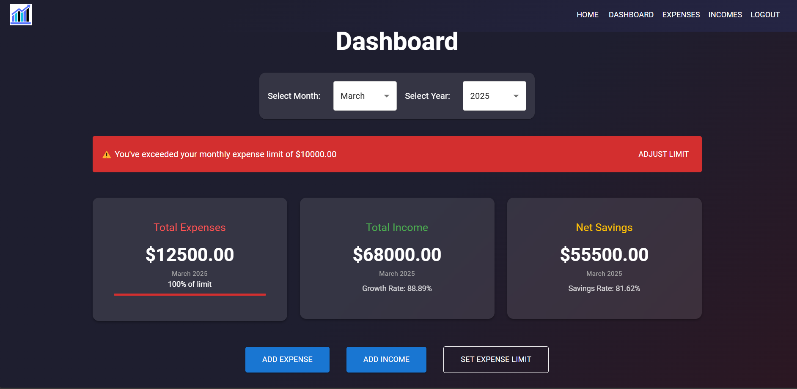

# Expense Tracker

A user-friendly app to track expenses, analyze spending patterns, and optimize budgets using smart algorithms.


## Features

- Add and delete transactions
- View income and expense summary
- Monthly tracking and categorization



- Pie and line charts for visualization




- **Smart Budget Optimization** using a Knapsack-inspired algorithm and Proportional Reduction to suggest optimal spending limits based on previous expense trends.



- Get alerts when expenses exceed beyond set limit

### Alerts


## Tech Stack

- **Frontend:** React, HTML, CSS, JavaScript
- **Backend:** Node.js, Express, MongoDB
- **Charts:** Chart.js 

## Getting Started


### 1. Clone the Repository
```bash
git clone https://github.com/Puja-01/ExpenseTracker.git
cd ExpenseTracker
```

### 2. Setup Backend
```bash
cd backend
npm install
npm run dev
```

Add a `.env` file in the backend directory:
```
MONGO_URI=your_mongodb_connection_string
JWT_SECRET=your_jwt_secret_key
PORT=5000
```

### 3. Setup Frontend
```bash
cd ../frontend
npm install
npm start
```

## Live Demo

Check out the live app: [Expense Tracker Live](https://expensetracker-1wbg.onrender.com)


